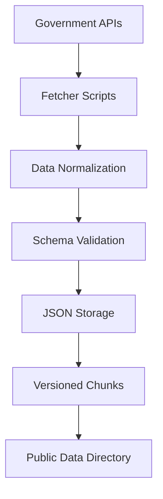
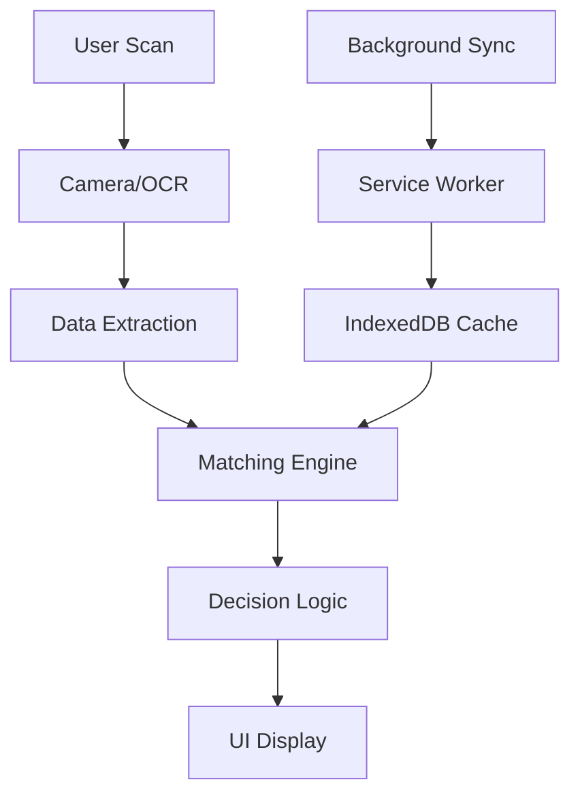
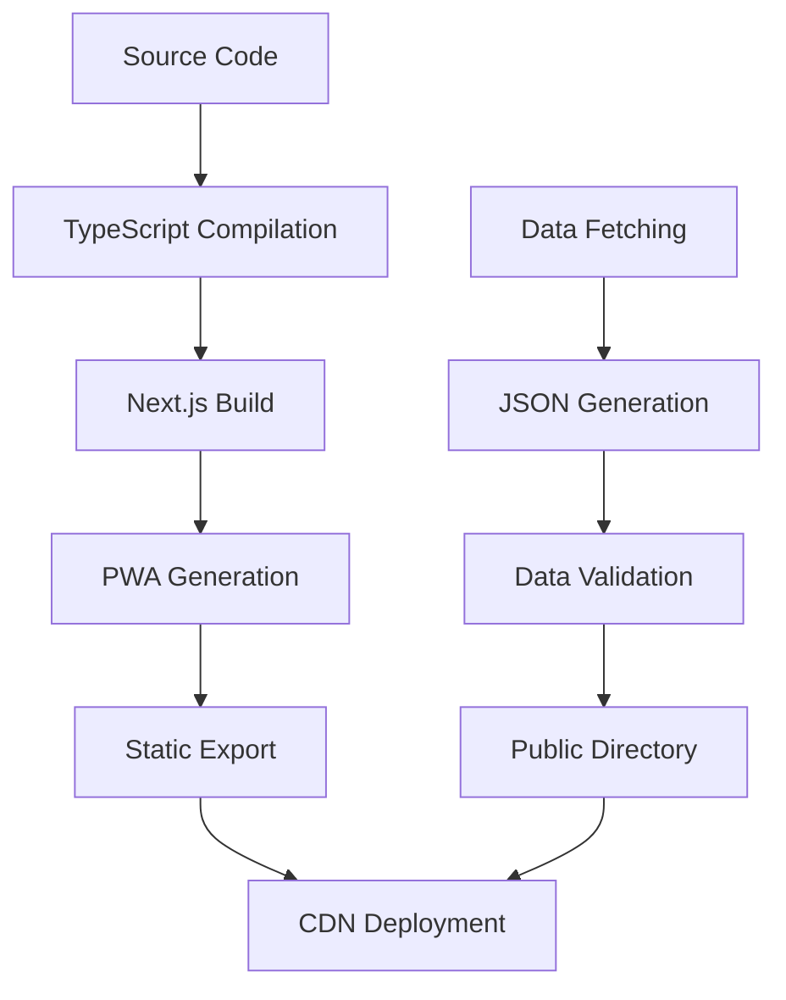

# RecallLens Architecture

## System Overview

RecallLens is built as a privacy-first Progressive Web App with a monorepo structure, emphasizing offline functionality and local data processing.

## Monorepo Structure

```
recalllens/
├── apps/
│   └── web/                 # Next.js PWA application
├── packages/
│   ├── core/               # Shared types, utilities, matching logic
│   ├── fetchers/           # Data ingestion from government APIs
│   └── fixtures/           # Test data and sample images
├── docs/                   # Documentation
└── .github/workflows/      # CI/CD pipelines
```

## Technology Stack

### Frontend (apps/web)
- **Framework**: Next.js 14 with App Router
- **Language**: TypeScript
- **Styling**: Tailwind CSS + Headless UI
- **State Management**: Zustand
- **Data Fetching**: TanStack Query
- **PWA**: next-pwa with custom Service Worker

### Core Libraries (packages/core)
- **Validation**: Zod schemas
- **Barcode Processing**: Custom UPC/EAN utilities
- **Text Matching**: Jaro-Winkler + Cosine similarity
- **Date Parsing**: Custom lot/expiry parsers

### Data Layer (packages/fetchers)
- **HTTP Client**: Axios
- **HTML Parsing**: Cheerio
- **CLI**: Commander.js
- **File System**: fs-extra

## Data Flow Architecture

### 1. Data Ingestion Pipeline



**Components:**
- **FDA Fetcher**: openFDA Food Enforcement API
- **FSIS Fetcher**: FSIS Recall API  
- **CPSC Fetcher**: CPSC Recall API
- **Normalizers**: Convert each source to unified schema
- **Validators**: Zod schema validation
- **Chunking**: Split large datasets for performance

### 2. Client-Side Data Flow



**Components:**
- **Camera Scanner**: @zxing/library for barcode detection
- **OCR Worker**: Tesseract.js for lot/expiry extraction
- **Matching Worker**: Core matching logic in Web Worker
- **IndexedDB**: Local data storage with idb
- **Service Worker**: Offline caching and background sync

## Matching Engine Architecture

### Three-Tier Matching System

#### Tier 1: Exact UPC Match
```typescript
// High confidence, immediate RED if lot matches
if (upcMatch && (lotMatch || noLotRestrictions)) {
  return RED;
}
```

#### Tier 2: Brand + Product Fuzzy Match
```typescript
// Medium confidence, requires lot verification
if (brandMatch && productMatch) {
  return lotMatch ? RED : YELLOW;
}
```

#### Tier 3: Category Match
```typescript
// Low confidence, always YELLOW with verification
if (categoryMatch) {
  return YELLOW;
}
```

### Text Matching Algorithms

**Jaro-Winkler Similarity**
- Handles typos and variations
- Prefix bonus for brand names
- Threshold: 0.8 for brands, 0.7 for products

**Cosine Similarity (n-grams)**
- Character-level matching
- Handles word order changes
- Fallback for Jaro-Winkler

## PWA Architecture

### Service Worker Strategy

**Cache-First for Static Assets**
- App shell, icons, manifest
- Immediate offline functionality

**Network-First for Data**
- Recall data with background updates
- Stale-while-revalidate pattern

**Runtime Caching**
- API responses cached with TTL
- Images and media cached long-term

### Offline Data Management

**IndexedDB Schema**
```typescript
interface CacheEntry {
  key: string;           // "recalls-2024-01-15"
  data: RecallRecord[];
  timestamp: number;
  version: string;
}
```

**Background Sync**
- Daily data refresh when online
- Incremental updates when possible
- Conflict resolution for overlapping data

## Security Architecture

### Client-Side Security
- **CSP**: Strict Content Security Policy
- **HTTPS Only**: All communications encrypted
- **No Eval**: Disabled eval() and similar functions
- **Input Sanitization**: All user inputs validated

### Data Privacy
- **No Personal Data**: Only anonymous usage stats
- **Local Processing**: All matching done client-side
- **No Image Storage**: Camera frames processed in memory
- **Opt-in Telemetry**: Clear consent for analytics

### API Security
- **Rate Limiting**: Respectful API usage
- **Error Handling**: Graceful degradation
- **Data Validation**: All inputs validated with Zod

## Performance Architecture

### Bundle Optimization
- **Code Splitting**: Route-based and component-based
- **Tree Shaking**: Remove unused code
- **Dynamic Imports**: Lazy load heavy dependencies
- **Web Workers**: Offload CPU-intensive tasks

### Caching Strategy
- **Browser Cache**: Static assets with long TTL
- **Service Worker**: Intelligent caching with updates
- **IndexedDB**: Structured data storage
- **Memory Cache**: In-memory matching results

### Performance Budgets
- **Initial Load**: < 3 seconds on 3G
- **Scan to Result**: < 1.5 seconds
- **Bundle Size**: < 500KB gzipped
- **Data Cache**: < 50MB total

## Deployment Architecture

### Build Pipeline


### Hosting Strategy
- **Static Hosting**: Vercel/Netlify for PWA
- **CDN**: Global content delivery
- **Data Storage**: Versioned JSON files
- **CI/CD**: GitHub Actions for automation

## Monitoring & Analytics

### Performance Monitoring
- **Core Web Vitals**: LCP, FID, CLS tracking
- **Custom Metrics**: Scan success rate, time to result
- **Error Tracking**: Client-side error reporting

### Usage Analytics (Opt-in)
- **Anonymous Counters**: Scan counts, result types
- **Performance Data**: Load times, error rates
- **No Personal Data**: No PII collected

### Data Quality Monitoring
- **Source Health**: API availability and response times
- **Data Freshness**: Last update timestamps
- **Validation Errors**: Schema compliance tracking

## Scalability Considerations

### Data Growth
- **Chunking Strategy**: Split large datasets
- **Lazy Loading**: Load data on demand
- **Compression**: Gzip/Brotli for JSON files
- **Cleanup**: Remove old data versions

### User Growth
- **CDN Scaling**: Global content delivery
- **Caching Layers**: Multiple cache levels
- **Progressive Enhancement**: Works on all devices
- **Offline-First**: Reduces server load

### Feature Scaling
- **Modular Architecture**: Easy to add new sources
- **Plugin System**: Extensible matching rules
- **A/B Testing**: Feature flag system
- **Internationalization**: Multi-language support ready
